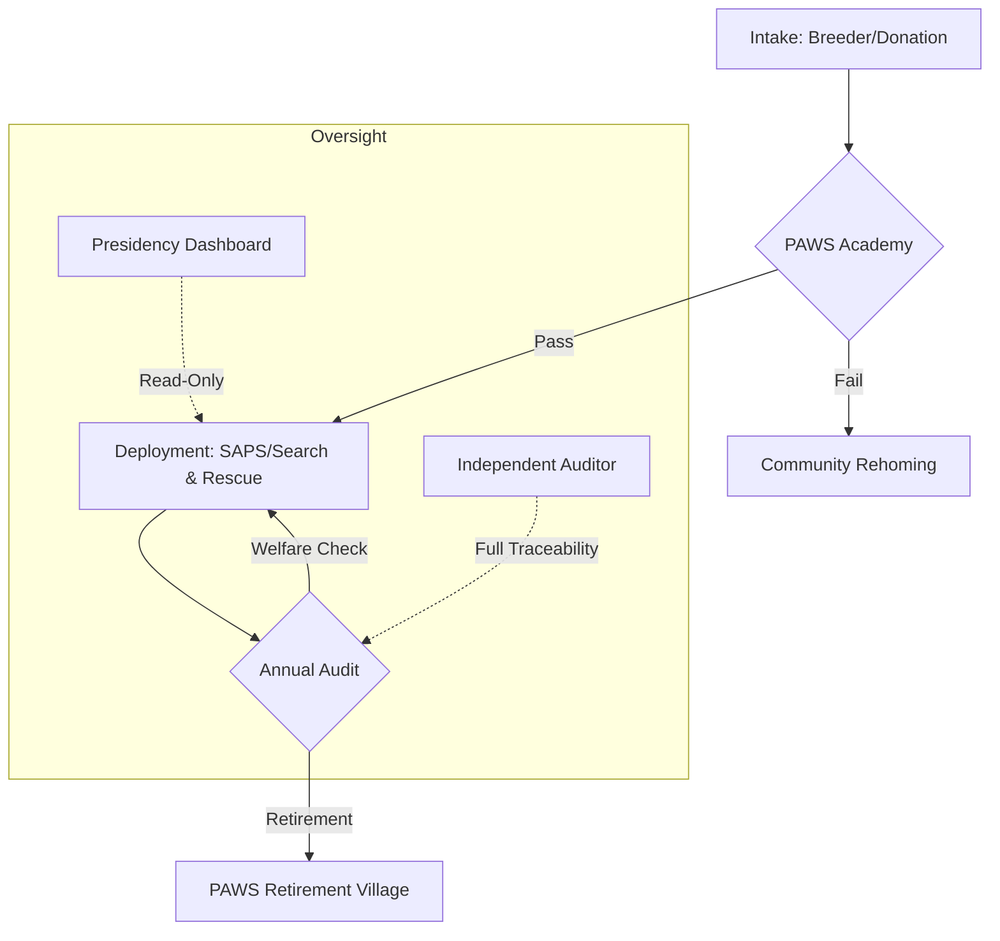

# Operation PAWS 🐾
### National K9 Command, Oversight, and Welfare System for South Africa

> **NOTICE:** This repository is a **proposal / pilot prototype reference architecture**. It is NOT operational until formally adopted by the relevant authorities. 

---

## 🚀 Elevator Pitch
Operation PAWS is an "open recipe, locked kitchen" command system designed to modernize South Africa's K9 units. It provides a transparent, auditable framework for the entire K9 lifecycle—from intake and training to high-risk deployment and retirement—ensuring that dog welfare and institutional integrity are never compromised.

## 🇿🇦 The South African Context
Current K9 operations face significant challenges:
- **Welfare Risks:** Lack of standardized, auditable health and retirement tracking.
- **Corruption & Diversion:** Risk of K9 assets being misused or diverted without a centralized trail.
- **Data Silos:** Provincial units operating without a unified national oversight layer.
- **Public Trust:** Need for verifiable proof that K9 units are used effectively and humanely.

PAWS solves this by making the **governance logic public** while keeping **operational data private**.

## ⚙️ How It Works

## 🗺️ Roadmap: From Pilot to National Scale

| Phase | Milestone | Scope | Status |
| :--- | :--- | :--- | :--- |
| **PAWS-10** | Technical Proof of Concept | 10 Dogs, 1 Unit | ✅ Complete |
| **PAWS-100** | Multi-Unit Stress Test | 100 Dogs, 5 Units | 🚧 Planning |
| **PAWS-500** | Simulated National Pilot | 500 Dogs, Provincial | 🔄 Simulated |
| **NATIONAL** | Full SAPS Integration | 2000+ Dogs | 📅 2027+ |

## 🛠️ Tech Stack & Security
- **Infrastructure:** Supabase (PostgreSQL, RLS, Edge Functions).
- **Identity:** 2FA via Totp, JWT-based Role Based Access Control (RBAC).
- **Auditability:** Immutable, append-only audit logs for every sensitive action.
- **AI Guardrails:** Phase-aware assistants for Officers, Command, and Oversight.

## 🔍 Explore the Demo
Stakeholders can explore the prototype via the following entry points:
1. **Command Center:** Open [paws_command_center.html](./paws_command_center.html) to see the Commissioner's strategic view.
2. **Public Tracker:** Visit the [Transparency Dashboard](docs/tracker/index.html) to see anonymized national stats.
3. **Documentation:**
   - [Governance Principles](01_GOVERNANCE.md)
   - [Data Boundary Rules](DATA_BOUNDARY.md)
   - [Operational Playbook](OPERATIONAL_PLAYBOOK.md)
   - [Pilot Close-Out Report](CLOSE_OUT_REPORT.md)

## 🚦 Start Here
If you are a new contributor or stakeholder, please review the following in order:
1. [STRUCTURE](Structure)
2. [GOVERNANCE](01_GOVERNANCE.md)
3. [SECURITY](SECURITY.md)
4. [CONTRIBUTING](CONTRIBUTING.md)

---
*Developed as a public-interest prototype for the K9 Modernization Initiative.*
